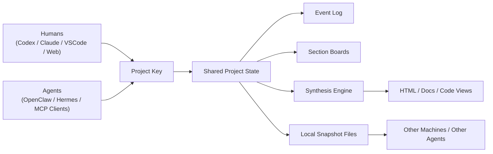

# DeepWork Positioning And Roadmap

Date: 2026-04-24

## One Sentence

DeepWork is a shared intent layer for human-agent collaboration: it lets multiple people and multiple agents form, update, attribute, and read the same project state across tools and machines.

## Why This Project Exists

Most collaboration software still treats the artifact as the unit of work:

- someone creates v1
- someone comments
- someone forks or rewrites into v2
- the team loses the real trail of intent

In the AI era, this gets worse. People and agents can each generate complete drafts very quickly, which creates more parallel versions, not more shared understanding.

The real bottleneck is no longer "can an agent produce output?"

The new bottleneck is:

- how multiple inputs enter one project
- how they are merged into a common state
- how changes remain visible and attributable
- how any agent can open the project and immediately understand the latest shared context

## Capability Layer View

The three reference images point to a shift in industry center of gravity:

1. `Weights` era: model quality, pretraining, scaling law, RLHF
2. `Context` era: RAG, prompting, long context, memory
3. `Harness` era: tools, MCP, skills, multi-agent, orchestration
4. `Ecosystem` era: governance, trust, marketplaces, permissions, agent operating systems

DeepWork should not be positioned as:

- a better prompt UI
- a prettier landing page generator
- just another multi-agent orchestrator

DeepWork sits in the transition from `Harness` to `Ecosystem`.

It is not primarily about making one agent stronger.
It is about making one project readable and writable by many humans and many agents at the same time.

## Core Product Thesis

When individual agent capability is already good enough, the next strategic layer is the shared project state:

- persistent
- agent-readable
- human-readable
- attributable
- governable
- cross-machine
- tool-agnostic

DeepWork is the system that maintains this state.

## Product Definition

### What DeepWork Is

DeepWork is a project collaboration protocol plus runtime.

It gives a project:

- an identity
- a shared intent graph
- an event stream
- structured sections or boards
- synthesized views
- attribution
- machine-readable snapshots

### What DeepWork Is Not

DeepWork is not:

- a single chatbot
- a single model wrapper
- only a landing page demo
- only a room chat
- only a file sync utility

The landing page demo is just the first visible proof that shared intent can become a better artifact than isolated drafts.

## The Core Objects

### 1. Project Key

A small stable file that tells any agent how to attach to the project.

Example responsibilities:

- project ID
- repo or workspace identity
- state endpoint
- local snapshot path
- protocol version
- enabled sections
- permission model

This file is the entry point, not the state itself.

### 2. Shared State Snapshot

A machine-readable snapshot of the latest project state.

It should contain:

- participants
- agents
- sections
- latest intents
- synthesis metadata
- attribution data
- last updated version

This is what a second machine, another IDE, or another agent should read immediately on project open.

### 3. Event Stream

Every meaningful project action should append an event:

- room joined
- intent created
- synthesis completed
- section added
- decision accepted
- conflict marked

This preserves project evolution and makes the current state auditable.

### 4. Synthesis Layer

This is the intelligence layer that converts distributed input into useful shared output:

- cluster related inputs
- detect conflicts
- produce section-level summaries
- create preview artifacts such as HTML
- preserve attribution

This should not silently erase disagreement.
The system should lower noise, not confiscate judgment.

### 5. Governance Layer

This becomes more important as the product moves toward the ecosystem layer.

Questions it must eventually answer:

- who can propose
- who can synthesize
- who can approve
- who can overwrite
- how conflicts are surfaced
- how trust is assigned to agents

## High-Level Architecture

## The Strongest Story To Tell

The strongest external narrative is not:

"We built a system where 5 people generate a landing page together."

The stronger narrative is:

"We built a shared intent layer for the agent era. When many people and many agents work on the same project, DeepWork turns fragmented prompts and drafts into one readable, attributable, continuously updated project state."

## Hackathon Narrative

For a hackathon or demo day, the story should be:

1. Old collaboration is artifact plus comment
2. AI makes artifact production cheap, so version sprawl gets worse
3. The new unit of collaboration must be intent plus synthesis
4. DeepWork captures live intent from multiple contributors
5. It synthesizes a shared result while preserving attribution
6. The output is not just a page, but a living project state any agent can reopen

## Product Wedge

The wedge remains the landing page demo because it is easy to see:

- many people contribute
- sections update live
- synthesis creates a coherent result
- attribution remains visible

But the real product underneath is broader:

- project state protocol
- state snapshots
- agent-readable collaboration memory
- governance-ready synthesis workflow

## Current Stage

Today this repo already contains parts of the wedge:

- room-based collaboration
- live intent collection
- section-aware intent submission
- synthesis to HTML
- attribution in the generated result
- local room snapshots written into the workspace

This means the project has moved beyond pure concept.
The next task is not "invent a direction."
The next task is "turn the wedge into a reusable protocol."

## What To Build Next

### Phase 1: Strong Demo System

Goal: prove that shared intent produces better artifacts than isolated prompting.

Build:

- stronger synthesis quality
- visible conflict states
- section summaries
- single-user vs group comparison
- better result playback for demos

Success signal:

- every contributor recognizes their intent in the result
- the group output is visibly better than any single-role output

### Phase 2: Project State Protocol

Goal: make the system attachable to a real project rather than only a room UI.

Build:

- `.deepwork/project.json` or equivalent project key
- stable snapshot schema
- event schema
- cross-tool read protocol
- cross-machine sync strategy

Success signal:

- any supported agent can open the project and read the same latest state

### Phase 3: Multi-Agent Project Runtime

Goal: allow several agents to contribute to the same project without losing coordination.

Build:

- agent registration
- write scopes
- section ownership
- synthesis scheduling
- change review loop

Success signal:

- several agents can contribute without chaotic overwrites or hidden divergence

### Phase 4: Governance And Ecosystem

Goal: move from collaboration runtime to ecosystem layer.

Build:

- permissions
- role policies
- trust scoring
- approval workflows
- shared marketplace or skill registry
- organization-level project memory

Success signal:

- the same collaboration protocol works across teams, tools, and organizations

## What Not To Overbuild Yet

Do not prematurely build:

- full marketplace logic
- complex billing
- enterprise-grade org charts
- a giant autonomous multi-agent swarm

Those belong later.

Right now the highest-leverage work is:

- protocol clarity
- readable snapshots
- visible attribution
- conflict handling
- cross-machine state access

## Immediate Execution Priorities

### Priority 1

Define the first public protocol files:

- project key
- snapshot schema
- event schema

### Priority 2

Make the synthesis layer incremental:

- section summary refresh
- partial HTML refresh
- conflict markers

### Priority 3

Create one "agent open project" flow:

- agent reads project key
- agent loads snapshot
- agent understands sections and recent changes
- agent writes back through the same protocol

### Priority 4

Build a better demo:

- replay timeline
- highlight newly added intents
- compare shared output vs solo output
- show cross-machine readability

## Strategic Positioning

The sharpest way to position DeepWork is:

`DeepWork is not an agent tool. It is the collaboration protocol for projects in the agent era.`

Alternative phrasing:

`DeepWork turns a project from a folder of files into a living, shared, attributable state that humans and agents can co-maintain.`

## Open Questions

These are the most important unresolved product questions:

- What is the minimum project key format that multiple tools can adopt?
- Should cross-machine sync be file-sync-first, remote-state-first, or hybrid?
- How should the system distinguish suggestions, accepted decisions, and merged state?
- What is the minimal governance model for humans plus agents?
- How much synthesis should happen automatically vs manually triggered?

## Recommended Next Document

The next doc to write after this one should be:

`DeepWork Protocol v0`

It should define:

- project key schema
- snapshot schema
- event schema
- actor model
- write semantics
- merge semantics
- attribution rules
